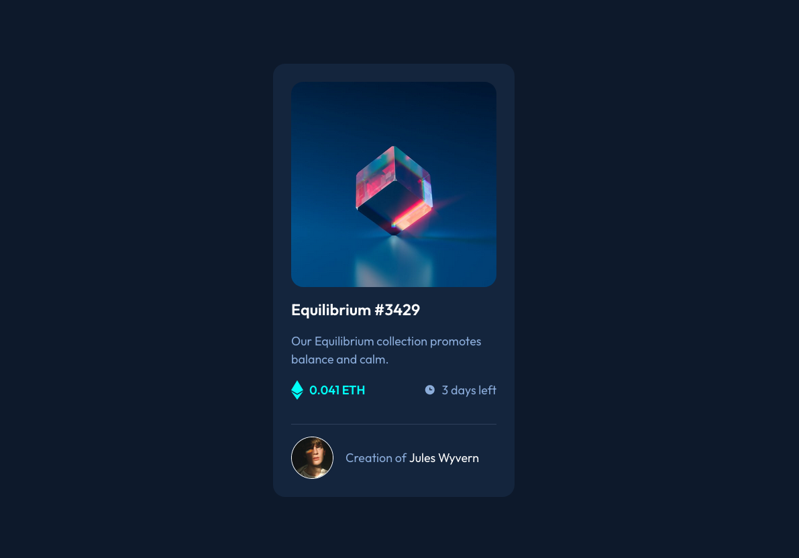

# Frontend Mentor - NFT preview card component solution

This is a solution to the [NFT preview card component challenge on Frontend Mentor](https://www.frontendmentor.io/challenges/nft-preview-card-component-SbdUL_w0U). Frontend Mentor challenges help you improve your coding skills by building realistic projects.  

## Table of contents

- [Overview](#overview)
  - [Screenshot Card](#screenshot)
  - [Links](#links)
- [My process](#my-process)
  - [Built with](#built-with)
  - [What I learned](#what-i-learned)
  - [Continued development](#continued-development)
- [Author](#author)

---

## Overview

### Screenshot



### Links

- Solution Frontend Mentor: [Frontend solution](https://www.frontendmentor.io/solutions/qr-code-murYUcVduA)
- Live Site: [Live site with GitHub Pages](https://marioferrer.github.io/FM-03_QR-code/)

## My process

### Built with

- Semantic HTML5 markup
- SCSS
- SCSS Mixins
- Flexbox


### What I learned

I have learned how to create an **overlay effect**. I got stuck for quite a while until I came up with a solution that I think is valid.
Here is an example, the code is this:

HTML
```html
<div class="overlay">
  <div class="overlay__wrapper">
    
    <div class="overlay__bg"></div>
  </div>

  
</div>
```

SCSS
```scss
.overlay {
  position: relative;

  &:hover .overlay__wrapper {
    opacity: 1;
    cursor: pointer;
  }

  &__wrapper {
    opacity: 0;
    transition: all .3s ease;
  }

  &__img {
    position: absolute;
    top: 0;
    bottom: 0;
    left: 0;
    right: 0;
    margin: auto;
    width: 3rem;
    z-index: 4;
  }

  &__bg {
    position: absolute;
    width: 100%;
    height: 100%;
    background-color: $cyan;
    opacity: .4;
    border-radius: 1rem;
  }

  &__img--main {
    border-radius: 1rem;
    width: 100%;
  }
}
```

### Continued development

I have to keep working and improving SCSS nesting.

### Mentions

I have used and modified Eduardo Fierro's reset, here is his github profile. <br>
[Eduardo's github profile](https://github.com/eduardofierropro/Reset-CSS)

## Author

- Github - [My GitHub Profile](https://github.com/marioferrer)
- Frontend Mentor - [@marioferrer](https://www.frontendmentor.io/profile/marioferrer)


